# Database

PostgreSQL is the system of record. Every major entity carries `workspace_id`. Primary keys
are UUIDv7 (time-ordered). Enums are stored as `VARCHAR` with a `CHECK` constraint, so adding
a value never needs a type migration. Migrations live in
`apps/api/app/db/migrations` (Alembic); `python -m app.db.migrate` applies them, creates the
LangGraph checkpoint tables (`checkpoints`, `checkpoint_blobs`, `checkpoint_writes`,
`checkpoint_migrations`, managed by `langgraph-checkpoint-postgres`) and seeds the demo.

## State ownership

| Data | Owner | Notes |
| --- | --- | --- |
| Resumable execution state | LangGraph checkpoint tables (thread id = execution id) | Resume, retry and recovery read only from here |
| `executions`, `execution_nodes`, `execution_events` | Read model | Written by the worker after each step; rebuildable |
| `tool_calls`, `approvals` | Authority for side effects | `tool_calls.idempotency_key` is unique and written before execution |
| `audit_events` | Append-only | `UPDATE`/`DELETE`/`TRUNCATE` rejected by triggers and revoked from `PUBLIC` |
| `secrets` | Envelope-encrypted values | Other tables store only `secret:<uuid>` references |

## Entity relationship diagram

Generated from the SQLAlchemy models.

```mermaid
erDiagram
  users {
    string email UK
    string display_name
    string password_hash
    boolean is_active
    datetime last_login_at
    uuid id PK
    datetime created_at
    datetime updated_at
  }
  workspaces {
    string name
    string slug UK
    jsonb settings
    uuid id PK
    datetime created_at
    datetime updated_at
  }
  audit_events {
    uuid workspace_id FK
    string actor_type
    string actor_id
    string actor_label
    string event_type
    string entity_type
    string entity_id
    uuid execution_id
    jsonb payload
    string request_id
    string ip
    datetime created_at
    uuid id PK
  }
  llm_providers {
    string name
    enum provider_type
    string base_url
    string api_key_secret_ref
    boolean is_active
    jsonb metadata
    integer requests_per_minute
    integer max_concurrency
    boolean last_test_ok
    datetime last_test_at
    string last_test_message
    uuid id PK
    datetime created_at
    datetime updated_at
    uuid workspace_id FK
  }
  mcp_servers {
    string name
    string slug
    text description
    enum transport
    string command
    jsonb args
    string cwd
    string url
    jsonb env_refs
    jsonb header_refs
    enum isolation
    enum status
    string status_message
    boolean is_active
    double connect_timeout_s
    double call_timeout_s
    integer requests_per_minute
    string config_hash
    datetime last_connected_at
    datetime last_discovered_at
    datetime command_confirmed_at
    uuid id PK
    datetime created_at
    datetime updated_at
    uuid workspace_id FK
  }
  notification_channels {
    string name
    enum channel_type
    string url_secret_ref
    string signing_secret_ref
    jsonb events
    boolean is_active
    boolean last_delivery_ok
    datetime last_delivery_at
    uuid id PK
    datetime created_at
    datetime updated_at
    uuid workspace_id FK
  }
  pipelines {
    string name
    string slug
    text description
    uuid latest_version_id FK
    integer latest_version_number
    boolean is_archived
    string webhook_secret_ref
    uuid id PK
    datetime created_at
    datetime updated_at
    uuid workspace_id FK
  }
  prompt_templates {
    string name
    string description
    integer latest_version
    uuid id PK
    datetime created_at
    datetime updated_at
    uuid workspace_id FK
  }
  prompt_variables {
    string key
    text value
    string description
    uuid id PK
    datetime created_at
    datetime updated_at
    uuid workspace_id FK
  }
  secrets {
    string name
    string description
    largebinary ciphertext
    largebinary nonce
    largebinary wrapped_data_key
    largebinary key_nonce
    integer key_version
    string hint
    integer version
    datetime rotated_at
    boolean managed
    uuid id PK
    datetime created_at
    datetime updated_at
    uuid workspace_id FK
  }
  user_sessions {
    uuid user_id FK
    uuid workspace_id FK
    string token_hash UK
    string csrf_token
    datetime expires_at
    datetime revoked_at
    string ip
    string user_agent
    uuid id PK
    datetime created_at
    datetime updated_at
  }
  workspace_members {
    uuid workspace_id FK
    uuid user_id FK
    enum role
    uuid id PK
    datetime created_at
    datetime updated_at
  }
  llm_models {
    uuid provider_id FK
    string model_name
    string display_name
    integer context_window
    boolean supports_tools
    boolean supports_streaming
    boolean supports_json_schema
    jsonb default_parameters
    numeric input_price_per_mtok
    numeric output_price_per_mtok
    boolean is_active
    boolean is_default
    uuid id PK
    datetime created_at
    datetime updated_at
    uuid workspace_id FK
  }
  mcp_tools {
    uuid server_id FK
    string name
    string title
    text description
    jsonb input_schema
    jsonb output_schema
    jsonb annotations
    string schema_hash
    boolean is_enabled
    boolean is_read_only
    boolean is_destructive
    boolean requires_approval
    enum risk_level
    boolean is_stale
    datetime last_discovered_at
    uuid id PK
    datetime created_at
    datetime updated_at
    uuid workspace_id FK
  }
  pipeline_versions {
    uuid pipeline_id FK
    integer version
    jsonb graph
    string graph_hash
    string change_note
    uuid created_by FK
    uuid id PK
    datetime created_at
    datetime updated_at
  }
  prompt_template_versions {
    uuid template_id FK
    integer version
    text body
    jsonb variables
    uuid created_by FK
    string change_note
    uuid id PK
    datetime created_at
    datetime updated_at
  }
  schedules {
    uuid pipeline_id FK
    string name
    enum kind
    string cron
    integer interval_seconds
    string daily_time
    string timezone
    jsonb input
    enum overlap_policy
    boolean is_active
    datetime last_run_at
    datetime next_run_at
    uuid id PK
    datetime created_at
    datetime updated_at
    uuid workspace_id FK
  }
  executions {
    uuid pipeline_id FK
    uuid pipeline_version_id FK
    enum trigger
    uuid triggered_by FK
    uuid schedule_id FK
    uuid restarted_from_id FK
    enum status
    jsonb input
    jsonb output
    jsonb config_snapshot
    string thread_id UK
    jsonb error
    boolean cancel_requested
    boolean pause_requested
    integer retries_used
    string lease_owner
    datetime lease_expires_at
    datetime started_at
    datetime finished_at
    biginteger last_event_seq
    integer total_tokens
    numeric estimated_cost
    uuid id PK
    datetime created_at
    datetime updated_at
    uuid workspace_id FK
  }
  durable_timers {
    uuid execution_id FK
    string node_id
    datetime wake_at
    datetime fired_at
    uuid id PK
    datetime created_at
    datetime updated_at
  }
  execution_events {
    uuid workspace_id FK
    uuid execution_id FK
    biginteger seq
    enum type
    string node_id
    uuid tool_call_id
    uuid approval_id
    jsonb payload
    datetime created_at
    uuid id PK
  }
  execution_nodes {
    uuid execution_id FK
    string node_id
    enum node_type
    string name
    enum status
    integer attempts
    jsonb input_summary
    jsonb output_summary
    jsonb error
    datetime started_at
    datetime finished_at
    uuid id PK
    datetime created_at
    datetime updated_at
  }
  llm_usage {
    uuid execution_id FK
    string node_id
    uuid provider_id FK
    string provider
    string model
    integer input_tokens
    integer output_tokens
    integer total_tokens
    numeric estimated_cost
    integer latency_ms
    string stop_reason
    text summary
    datetime created_at
    uuid id PK
    uuid workspace_id FK
  }
  schedule_fires {
    uuid schedule_id FK
    datetime fire_at
    uuid execution_id FK
    string outcome
    string fired_by
    uuid id PK
    datetime created_at
    datetime updated_at
  }
  tool_calls {
    uuid execution_id FK
    string node_id
    integer call_seq
    string llm_tool_call_id
    uuid server_id FK
    uuid tool_id FK
    string tool_name
    string namespaced_name
    jsonb arguments
    string idempotency_key
    enum status
    jsonb policy_decision
    boolean is_read_only
    jsonb result
    jsonb error
    integer duration_ms
    integer attempt
    datetime started_at
    datetime finished_at
    uuid id PK
    datetime created_at
    datetime updated_at
    uuid workspace_id FK
  }
  approvals {
    uuid execution_id FK
    string node_id
    enum kind
    uuid tool_call_id FK
    enum status
    string title
    text summary
    string risk_level
    jsonb reasons
    jsonb original_arguments
    jsonb edited_arguments
    jsonb payload
    string decision
    uuid decided_by FK
    datetime decided_at
    text reason
    text feedback
    jsonb resolution
    uuid superseded_by FK
    datetime expires_at
    boolean resumed
    uuid id PK
    datetime created_at
    datetime updated_at
    uuid workspace_id FK
  }
  workspaces ||--o{ audit_events : "workspace_id"
  workspaces ||--o{ llm_providers : "workspace_id"
  workspaces ||--o{ mcp_servers : "workspace_id"
  workspaces ||--o{ notification_channels : "workspace_id"
  pipeline_versions ||--o{ pipelines : "latest_version_id"
  workspaces ||--o{ pipelines : "workspace_id"
  workspaces ||--o{ prompt_templates : "workspace_id"
  workspaces ||--o{ prompt_variables : "workspace_id"
  workspaces ||--o{ secrets : "workspace_id"
  workspaces ||--o{ user_sessions : "workspace_id"
  users ||--o{ user_sessions : "user_id"
  workspaces ||--o{ workspace_members : "workspace_id"
  users ||--o{ workspace_members : "user_id"
  llm_providers ||--o{ llm_models : "provider_id"
  workspaces ||--o{ llm_models : "workspace_id"
  mcp_servers ||--o{ mcp_tools : "server_id"
  workspaces ||--o{ mcp_tools : "workspace_id"
  pipelines ||--o{ pipeline_versions : "pipeline_id"
  users ||--o{ pipeline_versions : "created_by"
  users ||--o{ prompt_template_versions : "created_by"
  prompt_templates ||--o{ prompt_template_versions : "template_id"
  workspaces ||--o{ schedules : "workspace_id"
  pipelines ||--o{ schedules : "pipeline_id"
  executions ||--o{ executions : "restarted_from_id"
  pipeline_versions ||--o{ executions : "pipeline_version_id"
  workspaces ||--o{ executions : "workspace_id"
  schedules ||--o{ executions : "schedule_id"
  users ||--o{ executions : "triggered_by"
  pipelines ||--o{ executions : "pipeline_id"
  executions ||--o{ durable_timers : "execution_id"
  workspaces ||--o{ execution_events : "workspace_id"
  executions ||--o{ execution_events : "execution_id"
  executions ||--o{ execution_nodes : "execution_id"
  executions ||--o{ llm_usage : "execution_id"
  llm_providers ||--o{ llm_usage : "provider_id"
  workspaces ||--o{ llm_usage : "workspace_id"
  executions ||--o{ schedule_fires : "execution_id"
  schedules ||--o{ schedule_fires : "schedule_id"
  workspaces ||--o{ tool_calls : "workspace_id"
  mcp_servers ||--o{ tool_calls : "server_id"
  executions ||--o{ tool_calls : "execution_id"
  mcp_tools ||--o{ tool_calls : "tool_id"
  workspaces ||--o{ approvals : "workspace_id"
  tool_calls ||--o{ approvals : "tool_call_id"
  approvals ||--o{ approvals : "superseded_by"
  users ||--o{ approvals : "decided_by"
  executions ||--o{ approvals : "execution_id"
```

## Indexes and constraints

| Table | Index / constraint | Columns | Notes |
| --- | --- | --- | --- |
| users | unique | email | |
| workspaces | unique | slug | |
| audit_events | ix_audit_events_event_type | event_type |  |
| audit_events | ix_audit_ws_created | workspace_id, created_at |  |
| audit_events | ix_audit_entity | entity_type, entity_id |  |
| audit_events | ix_audit_events_execution_id | execution_id |  |
| llm_providers | ix_llm_providers_workspace_id | workspace_id |  |
| llm_providers | unique | workspace_id, name | |
| mcp_servers | ix_mcp_servers_workspace_id | workspace_id |  |
| mcp_servers | unique | workspace_id, slug | |
| mcp_servers | check ck_mcp_servers_transport_target | | `(transport = 'stdio' AND command IS NOT NULL) OR (transport <> 'stdio' AND url IS NOT NULL)` |
| notification_channels | ix_notification_channels_workspace_id | workspace_id |  |
| notification_channels | unique | workspace_id, name | |
| pipelines | ix_pipelines_workspace_id | workspace_id |  |
| pipelines | unique | workspace_id, slug | |
| prompt_templates | ix_prompt_templates_workspace_id | workspace_id |  |
| prompt_templates | unique | workspace_id, name | |
| prompt_variables | ix_prompt_variables_workspace_id | workspace_id |  |
| prompt_variables | unique | workspace_id, key | |
| secrets | ix_secrets_workspace_id | workspace_id |  |
| secrets | unique | workspace_id, name | |
| user_sessions | ix_user_sessions_expires_at | expires_at |  |
| user_sessions | ix_user_sessions_user_id | user_id |  |
| user_sessions | unique | token_hash | |
| workspace_members | ix_workspace_members_user_id | user_id |  |
| workspace_members | ix_workspace_members_workspace_id | workspace_id |  |
| workspace_members | unique | workspace_id, user_id | |
| llm_models | ix_llm_models_provider_id | provider_id |  |
| llm_models | ix_llm_models_workspace_id | workspace_id |  |
| llm_models | unique | provider_id, model_name | |
| mcp_tools | ix_mcp_tools_workspace_id | workspace_id |  |
| mcp_tools | ix_mcp_tools_server_id | server_id |  |
| mcp_tools | unique | server_id, name | |
| pipeline_versions | ix_pipeline_versions_pipeline_id | pipeline_id |  |
| pipeline_versions | unique | pipeline_id, version | |
| prompt_template_versions | ix_prompt_template_versions_template_id | template_id |  |
| prompt_template_versions | unique | template_id, version | |
| schedules | ix_schedules_workspace_id | workspace_id |  |
| schedules | ix_schedules_pipeline_id | pipeline_id |  |
| schedules | ix_schedules_next_run_at | next_run_at |  |
| executions | ix_executions_workspace_id | workspace_id |  |
| executions | ix_executions_pipeline_version_id | pipeline_version_id |  |
| executions | ix_executions_lease | status, lease_expires_at |  |
| executions | ix_executions_ws_status_created | workspace_id, status, created_at |  |
| executions | ix_executions_pipeline_id | pipeline_id |  |
| executions | unique | thread_id | |
| durable_timers | ix_durable_timers_wake_at | wake_at |  |
| durable_timers | unique | execution_id, node_id | |
| execution_events | ix_execution_events_workspace_id | workspace_id |  |
| execution_events | unique | execution_id, seq | |
| execution_nodes | ix_execution_nodes_execution_id | execution_id |  |
| execution_nodes | unique | execution_id, node_id | |
| llm_usage | ix_llm_usage_ws_created | workspace_id, created_at |  |
| llm_usage | ix_llm_usage_workspace_id | workspace_id |  |
| llm_usage | ix_llm_usage_execution_id | execution_id |  |
| schedule_fires | ix_schedule_fires_schedule_id | schedule_id |  |
| schedule_fires | unique | schedule_id, fire_at | |
| tool_calls | ix_tool_calls_exec_status | execution_id, status |  |
| tool_calls | ix_tool_calls_workspace_id | workspace_id |  |
| tool_calls | ix_tool_calls_execution_id | execution_id |  |
| tool_calls | unique | idempotency_key | |
| approvals | ix_approvals_execution_id | execution_id |  |
| approvals | ix_approvals_ws_status | workspace_id, status, created_at |  |
| approvals | uq_approvals_pending_tool_call | tool_call_id | unique where status = 'pending' |
| approvals | ix_approvals_workspace_id | workspace_id |  |
| approvals | ix_approvals_expires_at | expires_at |  |

## Notable rules

- `uq_approvals_pending_tool_call`: a tool call can have at most one *pending* approval.
- `schedule_fires (schedule_id, fire_at)` is unique: an occurrence fires exactly once even
  with several schedulers.
- `execution_events (execution_id, seq)` is unique and `seq` comes from an atomic
  `UPDATE executions SET last_event_seq = last_event_seq + 1 RETURNING`, so the sequence is
  gap-free per execution and clients replay with `after_seq`.
- `executions (status, lease_expires_at)` supports the recovery sweep; `lease_owner` and
  `lease_expires_at` implement the worker lease.
- `mcp_servers` has a check that stdio servers have a command and remote servers a URL.
- Deleting a pipeline that has executions archives it instead, so history stays reproducible
  (`executions.pipeline_version_id` is `ON DELETE RESTRICT`).
